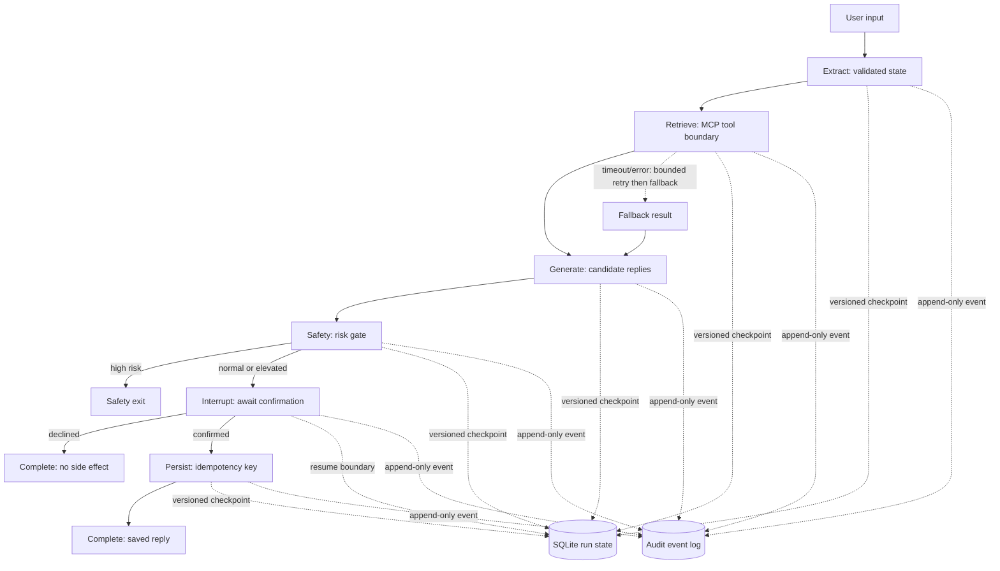

# Runtime Architecture

## Boundary Contract

The workflow owns state transition rules, checkpoint versions, retry budgets,
fallback semantics, confirmation, and audit records. Model and MCP adapters
are replaceable boundaries. The default test path uses deterministic local
adapters; the official MCP adapter is validated against a subprocess stdio
fixture.

## Recovery Scope

- Structured model validation retries are bounded; exhaustion ends in an
  audited `run_failed`.
- Tool timeouts and errors retry within the policy; retrieval can emit a
  recorded fallback result.
- A checkpoint version is accepted at most once by the shared in-process
  SQLite store. This is tested with two threads and does not claim distributed
  coordination.
- A confirmed save uses the run id as an idempotency key; repeated resume after
  completion is a no-op.
