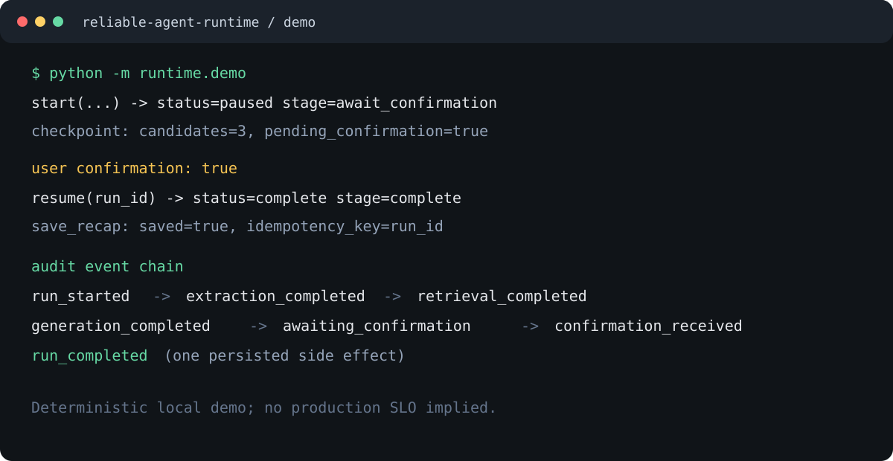
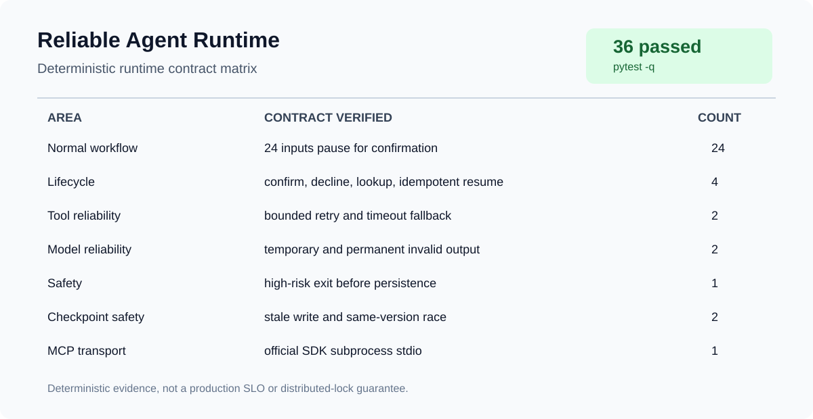

# Reliable Agent Runtime

This is an isolated MVP for a stateful, recoverable, auditable Agent runtime.
The existing research application in the repository is intentionally left
unchanged. The conversation scenario is only a deterministic workload used to
exercise runtime behavior.

## MVP scope

- explicit state machine with conditional routing;
- MCP-shaped local tool client with two tools;
- Pydantic validation for model outputs;
- timeout, bounded retry, and fallback handling;
- SQLite checkpoints and append-only event audit log;
- interrupt/resume at user confirmation;
- deterministic fault-injection tests.

The current implementation has no model or network dependency. A production
adapter can implement `StructuredModel` and an official MCP transport can
replace `LocalMCPClient` without changing the workflow or reliability layer.

## Run

From this directory:

```bash
python -m pytest -q
python -m runtime.demo
```

The demo pauses before sending a reply, then resumes after explicit
confirmation. It prints the run id, checkpoint stage, and audit events.



The reproducible fault matrix and observed test output are in
[`FAILURE_INJECTION_REPORT.md`](FAILURE_INJECTION_REPORT.md). A Mermaid
overview of the runtime is in
[`ARCHITECTURE.md`](ARCHITECTURE.md).

The compact test matrix is available in [`docs/TEST_MATRIX.md`](docs/TEST_MATRIX.md):



## Official MCP adapter

The default tests use the in-process `LocalMCPClient`. To connect the same
workflow to a real MCP server, install the optional SDK and use the adapter:

```python
from runtime.official_mcp import MCPServerConfig, OfficialMCPClient
from runtime.workflow import AgentRuntime

with OfficialMCPClient(
    MCPServerConfig(command="python", args=("my_mcp_server.py",))
) as mcp_client:
    runtime = AgentRuntime(tools=mcp_client)
    result = runtime.start("我想和室友讨论公共区域的卫生分工。")
```

The adapter keeps one persistent stdio session in a background event loop and
exposes the same synchronous tool boundary used by the MVP. A test launches a
separate official MCP SDK stdio server, discovers its `echo` tool, invokes it,
and closes the session. Timeout, retry, fallback and audit behavior remain in
the runtime, not in the transport.

## Documentation

- [Architecture](ARCHITECTURE.md)
- [Failure injection report](FAILURE_INJECTION_REPORT.md)
- [Test matrix](docs/TEST_MATRIX.md)

This project is a second-stage implementation built around reusable open-source
ideas; it does not claim to reimplement LangGraph or MCP.

## Architecture

```text
user input
    |
    v
[extract] -- structured model output --> facts / emotions / needs
    |
    v
[retrieve] -- reliable tool boundary --> local MCP-shaped knowledge tool
    |                         |
    |                         +--> timeout / error -> bounded retry
    |                                                -> fallback result
    v
[generate] -- Pydantic validation --> candidate replies
    |
    v
[safety] -- high risk ------------------------------> [safety_exit]
    |
    v
[await_confirmation] -- user rejects --> [complete, no send]
    |
    | user confirms
    v
[persist] -- idempotency key --> save_recap tool
    |
    v
[complete]

Every transition writes a versioned SQLite checkpoint and an append-only
audit event. The coordinator is independent from model and tool adapters, so
deterministic test doubles can later be replaced by an official MCP transport
or a hosted model.
```

## State Flow

Each run has one persisted `AgentState`. The `stage` is the next resumable
workflow boundary and `state_version` increases on every checkpoint.

| Stage | Responsibility | Exit condition |
|---|---|---|
| `extract` | Convert input into validated facts, emotions, needs and boundaries | Structured `Extraction` is valid |
| `retrieve` | Query the local knowledge tool through the retry boundary | Documents returned, or fallback recorded |
| `generate` | Produce bounded candidate replies | Candidates pass `CandidateReply` validation |
| `safety` | Classify risk before any reply can be sent | High risk exits; otherwise pause for confirmation |
| `await_confirmation` | Persist a user-visible interrupt | `resume(run_id, confirmed=...)` is called |
| `persist` | Save the selected reply with the run id as idempotency key | Save succeeds, or an audited error ends the run |
| `complete` | Terminal successful or user-declined state | No further transition |
| `safety_exit` | Terminal high-risk state with a safer user message | No reply is persisted |

### Resume and failure semantics

- A process can resume only from `await_confirmation`; other stages are
  advanced by `_advance` or are terminal.
- A declined confirmation emits `run_cancelled`, clears the final reply, and
  never emits `run_completed`.
- Repeated confirmation after completion is a no-op, so the recap is not saved
  twice.
- Tool calls use a bounded attempt budget. Timeout and exceptions become a
  structured `ToolOutcome`; fallback data is recorded as fallback.
- Invalid structured model output is retried up to the bounded policy;
  exhaustion produces an audited failed run.
- Checkpoint writes reject stale `state_version` values, preventing an older
  worker from overwriting newer state.

## Audit Event Order

A normal confirmed run is expected to produce:

```text
run_started
extraction_completed
retrieval_completed
generation_completed
awaiting_confirmation
confirmation_received
run_completed
```

Variants are explicit: a high-risk input ends with `safety_exit`; a declined
confirmation ends with `run_cancelled`; an exhausted model or tool boundary
ends with `run_failed`. The event log is the primary replay surface for
debugging and evaluation.
